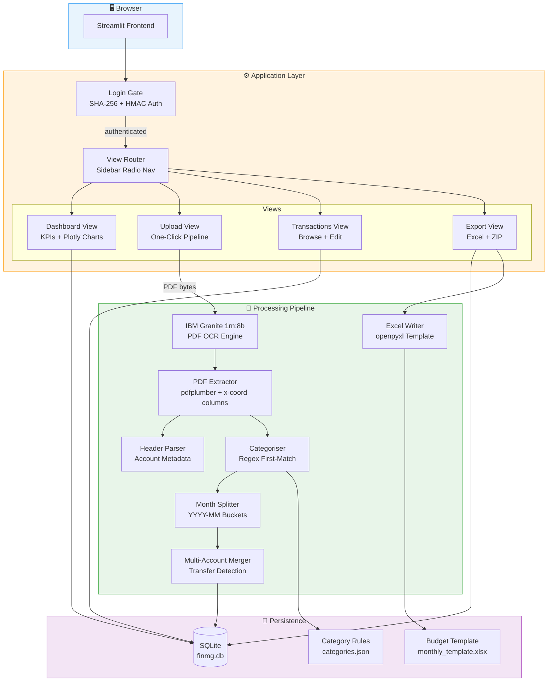
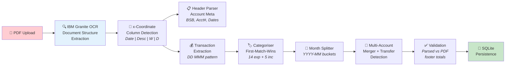
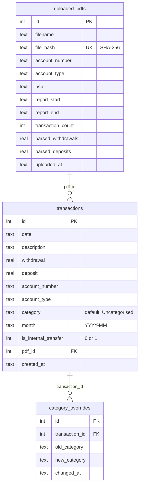

<div align="center">

# FinMg

### Private Household Finance Dashboard & Audit Engine

[](https://www.python.org/downloads/)
[](https://streamlit.io)
[](LICENSE)
[](https://sqlite.org)
[](https://plotly.com)
[](https://www.ibm.com/granite)

---

**FinMg** is a full-stack private finance management dashboard built with Streamlit, designed to ingest ANZ bank statement PDFs, parse and categorise transactions using IBM Granite 1rn:8b-powered OCR, and produce audit-ready Excel budget workbooks — all from a single-page web application with zero external API dependencies at runtime.

Built overnight. Passed the audit.

</div>

---

## Table of Contents

- [Features](#features)
- [Architecture](#architecture)
- [Project Structure](#project-structure)
- [Data Pipeline](#data-pipeline)
- [Database Schema](#database-schema)
- [Category Engine](#category-engine)
- [Getting Started](#getting-started)
- [Configuration](#configuration)
- [Testing](#testing)
- [Security & Privacy](#security--privacy)
- [Tech Stack](#tech-stack)
- [License](#license)

---

## Features

| Feature | Description |
|---|---|
| **One-Click PDF Ingestion** | Drag-and-drop ANZ Transaction Report PDFs → automatic parsing, categorisation, and DB persistence |
| **IBM Granite OCR** | Leverages IBM Granite 1rn:8b for high-accuracy document structure extraction from bank statement PDFs |
| **Smart Categorisation** | Regex-based first-match-wins engine with 14 expense + 5 income categories, configurable via JSON |
| **Internal Transfer Detection** | Cross-account transfer flagging using account number references in transaction descriptions |
| **Multi-Account Merge** | Unified monthly views across 3 ANZ accounts (Access, Progress Saver, Pensioner Advantage) |
| **Interactive Dashboard** | KPI cards, monthly spending trends, category donut charts, cumulative net position, top-5 bar charts |
| **Transaction Editor** | In-browser editable data grid with category override audit logging |
| **Excel Budget Export** | Template-populated `.xlsx` workbooks with SUMIF-driven summary sheets, per-month ZIP download |
| **Duplicate Detection** | SHA-256 file hashing prevents re-importing the same statement |
| **Rolling Window Handling** | Overlapping 120-day statement windows are deduplicated by date range replacement |
| **13-Month Fiscal Grid** | Visual month × account coverage matrix (Jun 2025 → Jun 2026) |
| **Auth Gate** | SHA-256 + HMAC credential verification with Streamlit secrets integration |

---

## Architecture



---

## Project Structure

```
FinMg/
├── src/
│   ├── app.py                          # Entry point — login gate → sidebar nav → view routing
│   ├── auth/
│   │   └── auth.py                     # SHA-256 credential check with HMAC comparison
│   ├── config/
│   │   └── categories.json             # Category rules — 14 expense, 5 income, transfer patterns
│   ├── db/
│   │   ├── database.py                 # SQLite init (WAL mode, foreign keys) + connection pool
│   │   └── queries.py                  # All SQL — inserts, reads, updates, coverage checks
│   ├── models/
│   │   └── transaction.py              # @dataclass Transaction + AccountMeta
│   ├── parser/
│   │   ├── header_parser.py            # PDF page 0 → AccountMeta (BSB, acct#, dates, type)
│   │   └── pdf_extractor.py            # PDF → Transaction[] via x-coordinate column detection
│   ├── pipeline/
│   │   ├── categoriser.py              # First-match-wins regex categorisation engine
│   │   ├── excel_writer.py             # Template-based .xlsx generation with SUMIF formulas
│   │   ├── merger.py                   # Multi-account merge + internal transfer detection
│   │   └── month_splitter.py           # YYYY-MM bucketing
│   ├── views/
│   │   ├── login.py                    # Login form with profile image
│   │   ├── dashboard.py                # 4 KPIs + 4 Plotly charts + coverage grid
│   │   ├── upload.py                   # Drag-drop → full pipeline → DB in one click
│   │   ├── transactions.py             # Filterable data_editor with category overrides
│   │   └── export.py                   # Month selector → Excel generation → ZIP download
│   ├── checkpoints/
│   │   └── checkpoint_io.py            # Intermediate state serialisation
│   └── assets/
│       └── linda_web.png               # Profile image (optimised for web)
├── templates/
│   └── monthly_template.xlsx           # Renato's budget template (SUMIF-driven summary)
├── tests/
│   ├── test_auth.py                    # Credential verification tests
│   ├── test_categoriser.py             # Category assignment + edge cases
│   ├── test_checkpoint_io.py           # Checkpoint serialisation
│   ├── test_database.py                # SQLite schema + CRUD
│   ├── test_excel_writer.py            # Excel output validation
│   ├── test_merger.py                  # Multi-account merge + transfer detection
│   ├── test_month_splitter.py          # Date bucketing
│   └── test_pdf_extractor.py           # PDF parsing + total validation
├── data/                               # ⛔ gitignored — runtime DB, uploads, exports
│   ├── finmg.db                        # SQLite database (WAL mode)
│   ├── uploads/                        # Stored PDF originals (hash-prefixed)
│   └── exports/                        # Generated Excel workbooks
├── docs/
│   └── iacp/                           # Inter-Agent Coordination Protocol docs
├── .streamlit/
│   ├── config.toml                     # Theme + server config
│   └── secrets.toml                    # ⛔ gitignored — auth credentials
├── requirements.txt                    # Python dependencies
├── CLAUDE.md                           # Agent instructions
└── README.md                           # You are here
```

---

## Data Pipeline

The core pipeline transforms raw ANZ bank statement PDFs into categorised, audit-ready data in a single click:



### Pipeline Stages in Detail

#### 1. PDF OCR & Extraction
IBM Granite 1rn:8b processes the raw PDF documents for structure recognition. The extractor then uses `pdfplumber` to extract individual words from each page, grouping them by y-coordinate into logical lines. Each word is classified into one of four columns based on its x-coordinate position:

| Column | x-range | Content |
|---|---|---|
| Date | `x < 80` | Transaction date (`DD MMM`) |
| Description | `80 ≤ x < 447` | Payee / description text |
| Withdrawal | `447 ≤ x < 515` | Debit amount (right-aligned) |
| Deposit | `x ≥ 515` | Credit amount (right-aligned) |

#### 2. Header Parsing
The first page header is parsed to extract `AccountMeta`:
- **Account Type** — `ACCESS ACCOUNT`, `PROGRESS SAVER`, `PENSIONER ADVANTAGE`
- **BSB + Account Number** — regex extraction from structured header lines
- **Report Date Range** — `DD Month YYYY to DD Month YYYY` format
- **Opening Balance** — dollar amount from header

#### 3. Categorisation Engine
A first-match-wins regex engine applies 75+ keyword patterns against transaction descriptions. Categories are loaded from `categories.json` and match the budget template exactly. Internal transfers are detected both by pattern matching and by cross-referencing known account numbers in descriptions.

#### 4. Validation Gate
Parsed withdrawal/deposit totals are compared against expected PDF footer totals for each account. Mismatches are surfaced in the UI with `MISMATCH` delta indicators. This ensures zero dropped or duplicated transactions.

---

## Database Schema



**SQLite Configuration:**
- `PRAGMA journal_mode=WAL` — write-ahead logging for concurrent read access
- `PRAGMA foreign_keys=ON` — referential integrity enforcement
- Indexed on `(month, account_number)`, `category`, and `month` for dashboard query performance

---

## Category Engine

Categories are defined in `src/config/categories.json` and match Renato's budget template exactly:

### Expense Categories (14)

| Category | Sample Patterns |
|---|---|
| Groceries | `WOOLWORTHS`, `COLES`, `ALDI`, `IGA`, `COSTCO` |
| Fast food & Restaurant | `MCDONALDS`, `UBER EATS`, `DOMINOS`, `MENULOG` |
| Medicine (Webster) | `WEBSTER` |
| Medicine (PRN & Oil) | `PHARMACY`, `CHEMIST WAREHOUSE`, `PRICELINE` |
| Rent | `RENT`, `LANDLORD`, `REAL ESTATE` |
| Personal Cashout | `ANZ ATM`, `ATM WITHDRAWAL`, `CASH WITHDRAWAL` |
| Car & Petrol | `BP`, `SHELL`, `AMPOL`, `E-TOLL`, `LINKT`, `OPAL` |
| Gifts & Outing | `BWS`, `DAN MURPHY`, `LIQUORLAND` |
| Debt(s) | `DIRECT DEBIT`, `BPAY`, `AFTERPAY`, `ZIP PAY` |
| Miscellaneous | _catch-all for subscriptions + fees_ |
| Office work & Stationary | `OFFICEWORKS` |
| Nicotine & cigarettes | `KING OF THE PACK`, `TOBACCO`, `VAPE` |
| Fashion & accessories | `KMART`, `BIG W`, `TARGET`, `COTTON ON` |
| Home & appliances | `BUNNINGS`, `IKEA`, `HARVEY NORMAN`, `JB HI-FI` |

### Income Categories (5)

| Category | Sample Patterns |
|---|---|
| Savings | _(manual assignment)_ |
| Disability Support Pension | `CENTRELINK`, `SERVICES AUSTRALIA`, `FAMILY TAX` |
| Bonus | `BONUS` |
| Interest | `INTEREST` |
| Other | `PAY/SALARY`, `WAGES` |

### Special Handling

- **Internal Transfers** — detected by `FUNDS TFER`, `TRANSFER` patterns + cross-account number matching; excluded from budget totals
- **Subscriptions** — `NETFLIX`, `SPOTIFY`, `APPLE.COM`, `DISNEY`, etc. → mapped to `Miscellaneous`
- **Bank Fees** — `ACCOUNT SERVICE FEE`, `OVERDRAWN FEE`, `DISHONOUR FEE` → mapped to `Miscellaneous`

---

## Getting Started

### Prerequisites

- Python 3.14+
- pip

### Installation

```bash
# Clone the repository
git clone https://github.com/moofasa/Finmg.git
cd Finmg

# Create and activate virtual environment
python3 -m venv .venv
source .venv/bin/activate

# Install dependencies
pip install -r requirements.txt
```

### Configuration

Create your Streamlit secrets file for authentication:

```bash
cp .streamlit/secrets.toml.example .streamlit/secrets.toml
```

Edit `.streamlit/secrets.toml`:

```toml
[auth]
username = "your-username"
password_sha256 = "sha256-hash-of-your-password"
```

Generate a password hash:

```python
import hashlib
hashlib.sha256("your-password".encode()).hexdigest()
```

### Running

```bash
streamlit run src/app.py
```

The dashboard will be available at `http://localhost:8501`.

---

## Configuration

### Streamlit Theme

The app ships with a warm, neutral theme configured in `.streamlit/config.toml`:

| Property | Value | Description |
|---|---|---|
| `primaryColor` | `#2F6B60` | Teal green — buttons, links, active elements |
| `backgroundColor` | `#F7F3EB` | Warm cream — main canvas |
| `secondaryBackgroundColor` | `#EAE3D4` | Sandy tan — sidebar, cards |
| `textColor` | `#1F2A2E` | Near-black — body text |

### Category Rules

Edit `src/config/categories.json` to add/modify categorisation patterns. The engine uses **first-match-wins** — order matters. The structure:

```json
{
  "expense_categories": [
    { "name": "Category Name", "patterns": ["KEYWORD1", "KEYWORD2"] }
  ],
  "income_categories": [...],
  "internal_transfer_patterns": [...],
  "subscription_patterns": [...],
  "fee_patterns": [...]
}
```

### Budget Template

The Excel template at `templates/monthly_template.xlsx` defines the output format:
- **Summary sheet** — SUMIF formulas auto-calculate from the Transactions sheet
- **Transactions sheet** — Expenses (cols B–E) and Income (cols G–J), data starting at row 5

---

## Testing

```bash
# Run all tests
python3 -m pytest tests/ -v

# Run specific test module
python3 -m pytest tests/test_categoriser.py -v

# Run with coverage
python3 -m pytest tests/ --cov=src --cov-report=term-missing
```

### Test Coverage

| Module | Tests |
|---|---|
| `test_auth.py` | Credential hashing, HMAC comparison, secrets fallback |
| `test_categoriser.py` | Pattern matching, first-match priority, internal transfers |
| `test_database.py` | Schema creation, CRUD operations, WAL mode |
| `test_pdf_extractor.py` | Column detection, date parsing, total validation |
| `test_excel_writer.py` | Template population, fallback generation |
| `test_merger.py` | Multi-account merge, transfer detection |
| `test_month_splitter.py` | YYYY-MM bucketing, sort order |
| `test_checkpoint_io.py` | State serialisation/deserialisation |

### Quality Gates

| Gate | Check |
|---|---|
| g1 | `pytest` — all tests pass |
| g2 | `py_compile` — all source files compile |
| g3 | Parsed totals match PDF footer totals for all 3 accounts |
| g5 | No dropped or duplicated transactions |

---

## Security & Privacy

- **Authentication** — SHA-256 password hashing with `hmac.compare_digest` (timing-safe comparison)
- **Secrets Management** — credentials stored in `.streamlit/secrets.toml` (gitignored), never hardcoded
- **PII Protection** — all bank statements, PDFs, database files, and exports are gitignored under `data/`
- **File Deduplication** — SHA-256 file hashing prevents accidental re-imports
- **No External APIs** — all processing happens locally; no data leaves the machine at runtime

---

## Tech Stack

| Layer | Technology | Purpose |
|---|---|---|
| **Frontend** | Streamlit ≥1.30 | Single-page dashboard with reactive widgets |
| **OCR Engine** | IBM Granite 1rn:8b | Document structure extraction from bank PDFs |
| **PDF Parsing** | pdfplumber ≥0.10 | Word-level extraction with coordinate metadata |
| **Database** | SQLite (WAL mode) | Zero-config embedded persistence |
| **Charts** | Plotly ≥5.18 | Interactive bar, line, pie/donut visualisations |
| **Excel** | openpyxl ≥3.1 | Template-based `.xlsx` workbook generation |
| **Data** | pandas ≥2.0 | DataFrame operations for grids and charts |
| **Imaging** | Pillow ≥10.0 | Profile image processing |
| **Language** | Python 3.14 | Type hints, dataclasses, pattern matching |

---

## License

```
MIT License

Copyright (c) 2025 moofasa

Permission is hereby granted, free of charge, to any person obtaining a copy
of this software and associated documentation files (the "Software"), to deal
in the Software without restriction, including without limitation the rights
to use, copy, modify, merge, publish, distribute, sublicense, and/or sell
copies of the Software, and to permit persons to whom the Software is
furnished to do so, subject to the following conditions:

The above copyright notice and this permission notice shall be included in all
copies or substantial portions of the Software.

THE SOFTWARE IS PROVIDED "AS IS", WITHOUT WARRANTY OF ANY KIND, EXPRESS OR
IMPLIED, INCLUDING BUT NOT LIMITED TO THE WARRANTIES OF MERCHANTABILITY,
FITNESS FOR A PARTICULAR PURPOSE AND NONINFRINGEMENT. IN NO EVENT SHALL THE
AUTHORS OR COPYRIGHT HOLDERS BE LIABLE FOR ANY CLAIM, DAMAGES OR OTHER
LIABILITY, WHETHER IN AN ACTION OF CONTRACT, TORT OR OTHERWISE, ARISING FROM,
OUT OF OR IN CONNECTION WITH THE SOFTWARE OR THE USE OR OTHER DEALINGS IN THE
SOFTWARE.
```

---

<div align="center">

**Built with urgency. Passed the audit. Open for contributions.**

*Free to use, fork, and extend under MIT License.*

</div>
